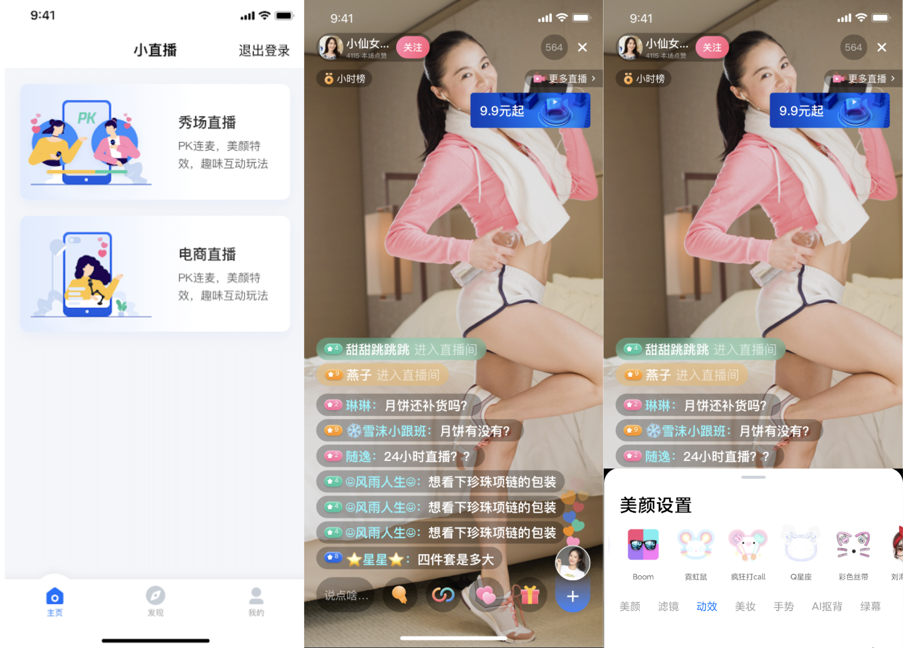

# 小直播场景化解决方案

## 概述

**小直播场景化解决方案**是腾讯云直播团队针对诸如**秀场直播、电商直播、企业直播**等多个音视频直播场景，推出的低代码解决方案，依托腾讯在音视频&通信领域的技术积累，帮助开发者快速实现相关业务场景，聚焦核心业务，助力业务起飞！

其他场景化解决方案：
- [一起合唱-TUIChorus](https://github.com/tencentyun/TUIChorus/)
- [Karaoke-TUIKaraoke](https://github.com/tencentyun/TUIKaraoke/)
- [视频互动直播-TUILiveRoom](https://github.com/tencentyun/TUILiveRoom/)
- [实时语音/视频通话-TUICalling](https://github.com/tencentyun/TUICalling/)
- [多人视频会议-TUIMeeting](https://github.com/tencentyun/TUIMeeting/)
- [语音聊天室-TUIVoiceRoom](https://github.com/tencentyun/TUIVoiceRoom/)

也欢迎加入我们的QQ交流群：592465424，期待一起交流&学习！

## 工程动态
### Version 9.3 @ 2021.11.16

- Android&iOS：小直播组件化版本上线；

## 效果图示

## 文档资源

- 腾讯云官网文档，请点击[快速跑通小直播App](https://cloud.tencent.com/document/product/454/38625)；
- 小直播后台开源服务，请点击[TencentServerlessApps/live-room](https://github.com/TencentServerlessApps/live-room)

### 交流&反馈

欢迎加入QQ群进行技术交流和反馈问题，QQ群：592465424

